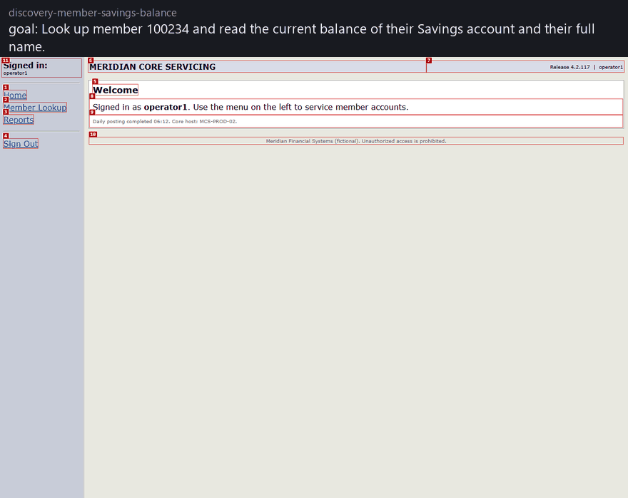
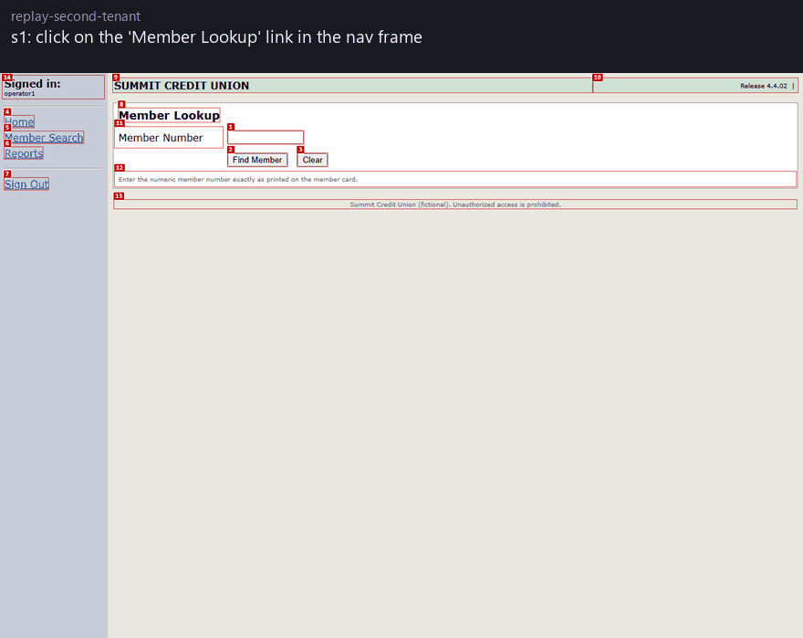
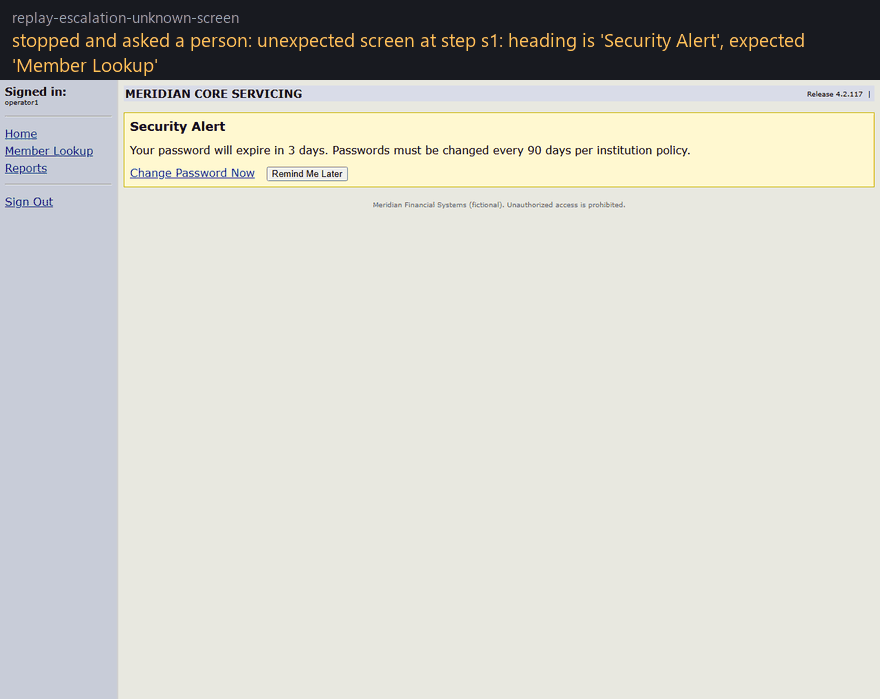

# teller

Record-once, replay-many UI automation for back-office apps that have no API.

A model works out how to finish a task inside a legacy web app once. That run is
recorded as a *capability*: typed inputs, typed outputs, the steps, how each control
is found, and what must be true after every step. From then on the capability
replays deterministically with no model in the loop, tells the caller apart
"the member does not exist" from "the app broke", and hands the live browser to a
person when it hits something it does not recognise.

This is my submission for the interface.ai computer-use take-home. The design
write-up is in [REPORT.md](REPORT.md); the recorded runs are under
[evidence/](evidence/README.md).

### The model works the flow out once

Red boxes are what the system offers the model: every control it may act on, numbered.
The caption on each frame is the model's own stated reason, taken from the run log.



### Then the same flow replays with no model, at another institution

Same capability file, never re-recorded. This tenant runs the same vendor product
with its own branding, a newer release, a content frame the integrator renamed, a
welcome banner, and a renamed menu item. A tenant overlay of fifteen lines covers
the first three, a fallback locator covers the last, and the run reports that it
needed the fallback.



### And stops for a person when it meets something it does not know



Every frame above is a screenshot the run itself saved, captioned from its own log.
Nothing is staged: `python scripts/make_filmstrip.py runs/<run id> out.gif` rebuilds
them from any run.

## What is in the box

| path | what it is |
|---|---|
| `teller/schema.py` | the capability artifact and result contracts (pydantic) |
| `teller/agent.py` | the discovery loop: observe, decide, act, with Claude driving |
| `teller/recorder.py` | turns a successful run into a parameterized capability |
| `teller/replay.py` | deterministic replay, checkpoints, error taxonomy, recovery |
| `teller/handoff.py`, `teller/operator.py` | control transfer to a person and back, on the same session |
| `teller/policy.py`, `policy.yaml` | allowlist, risky-action handling, redaction |
| `teller/surface/` | how the surface is perceived and acted on (Playwright today) |
| `teller/profiles/meridian.yaml` | per-app knowledge: sign-in, content frame, the known error screens |
| `tenants/` | per-institution overlay for a second deployment of the same product |
| `meridian/` | the target: a fictional legacy core-servicing console (frameset, table layouts, no ids), which can run as either of two institutions |
| `contracts/` | what the caller declares before discovery: goal, inputs, outputs |
| `capabilities/` | recorded capabilities |
| `evidence/` | logs, screenshots and artifacts from discovery and replay runs |

## Setup

Python 3.11+ and Chromium via Playwright. Tested on Windows 11 and Ubuntu (CI).

```bash
git clone https://github.com/sushantlokhande14/teller && cd teller
python -m venv .venv && source .venv/bin/activate      # Windows: .venv\Scripts\activate
pip install -e ".[dev]"
python -m playwright install chromium
cp .env.example .env
```

Discovery needs a model. Replay never calls one, so most of this repo runs with no
model at all. The model is a seam with three implementations: Anthropic (the
default), any OpenAI-compatible endpoint, and a scripted stand-in used by the tests.

The evidence in this repo was recorded with a local model through Ollama, which
costs nothing and needs no account:

```bash
ollama pull qwen2.5:7b
python -m teller discover contracts/member_savings_balance.json --input member_id=100234 --provider ollama --model qwen2.5:7b
```

To use Claude instead, put `ANTHROPIC_API_KEY` in `.env` and drop the two flags.
`--provider groq|gemini|openrouter|openai` reads the matching key from the
environment, and `--api-base` points at anything else that speaks the same
protocol. Pass `--vision` if the model accepts images.

The demo sign-in for the sample app is already in `.env.example`: the surface signs
in with `MERIDIAN_USER` / `MERIDIAN_PASS` before the model gets control, so the
model never sees or types a credential.

Start the target app in its own terminal and leave it running:

```bash
python -m meridian        # http://127.0.0.1:5057, sign in as operator1 / teller!23
```

## Demo path

**1. Discovery.** The caller declares the contract (goal, typed inputs, typed outputs)
in `contracts/member_savings_balance.json`. The model figures out the *how*.

```bash
python -m teller discover contracts/member_savings_balance.json --input member_id=100234 --provider ollama --model qwen2.5:7b --headed
```

This signs in, hands the model the live screen (numbered controls, plus a screenshot
carrying the same numbers for models that take images), and records what it does. On success it writes
`capabilities/member_savings_balance.json` and a run directory under `runs/` with
the full log, the screenshots, and the redacted model transcript.

**2. Review and approve.** Read the capability file; it is meant to be reviewable.
Replay refuses drafts by default, and approval is bound to a fingerprint of the
flow, so any later edit puts it back in draft.

```bash
python -m teller approve capabilities/member_savings_balance.json --by your-name
```

**3. Replay.** No model. Different member than the recording.

```bash
python -m teller replay capabilities/member_savings_balance.json --input member_id=101502
```

The result is a JSON document with `status` of `success` (with the typed outputs),
`outcome` (a legitimate business answer, like `not_found`) or `failure` (with the
step, what was expected, what was observed, and paths to a screenshot and a page
snapshot). Exit codes: 0, 3, 1 respectively.

**4. Runtime errors.** The sample app can be told to misbehave on the next request.
`--fault` injects it once the session is established, so the failure lands mid-flow.

```bash
python -m teller replay capabilities/member_savings_balance.json --input member_id=999999                 # outcome: not_found
python -m teller replay capabilities/member_savings_balance.json --input member_id=100234 --fault session_expired
python -m teller replay capabilities/member_savings_balance.json --input member_id=100234 --fault notice
python -m teller replay capabilities/member_savings_balance.json --input member_id=100234 --fault slow
python -m teller replay capabilities/member_savings_balance.json --input member_id=100234 --fault permission     # outcome: permission_denied
python -m teller replay capabilities/member_savings_balance.json --input member_id=100234 --fault error          # failure with evidence
```

| fault | what the app does | what replay does |
|---|---|---|
| `session_expired` | drops the session on the next request | signs in again, re-runs the page it was on |
| `notice` | shows a maintenance interstitial until acknowledged | clicks Acknowledge, carries on |
| `slow` | serves a "core host is busy" page that refreshes itself | waits, re-checks the checkpoint |
| `permission` | 403 on the next page | returns outcome `permission_denied` to the caller |
| `error` | 500 with an ORA reference | stops; failure with screenshot and snapshot |
| `surprise` | a password-expiry alert the profile knows nothing about | hands the session to a person |

**5. Escalation.** Two terminals. The first runs a replay that will hit the unknown
alert; the second is the operator.

```bash
python -m teller replay capabilities/member_savings_balance.json --input member_id=100234 --fault surprise --headed --cdp-port 9333
```

```bash
python -m teller operator runs/<run id printed by the replay>
```

The operator terminal shows why the run stopped, the step, the URL, the screenshot
path and the CDP endpoint of the live browser. Click "Remind Me Later" in the
browser window the replay opened, type `resume`, and the replay re-checks its
checkpoint and finishes. What you did in the browser is captured into the run log
and the result. For unattended runs the same thing can be scripted:

```bash
python -m teller replay capabilities/member_savings_balance.json --input member_id=100234 --fault surprise --operator scripts/operator_dismiss_alert.json
```

That starts the operator as a separate process which attaches to the same browser
over CDP, performs the click, and replies.

**6. A risky capability.** Opening a sub-account posts to the core. The policy marks
the confirm click risky, so both discovery and replay stop for approval.

```bash
python -m teller discover contracts/open_savings_subaccount.json --input member_id=100234 --input "nickname=Vacation fund" --input deposit=25.00 --provider ollama --model qwen2.5:7b --operator scripts/operator_approve.json
python -m teller approve capabilities/open_savings_subaccount.json --by your-name
python -m teller replay capabilities/open_savings_subaccount.json --input member_id=100234 --input "nickname=Rainy day" --input deposit=40.00 --operator scripts/operator_approve.json
python -m teller replay capabilities/open_savings_subaccount.json --input member_id=100877 --input nickname=Holiday --input deposit=10.00 --operator scripts/operator_decline.json
```

**7. A second institution running the same product.** Start the other deployment in a
third terminal, then replay the capability you already recorded, unchanged, against it.

```bash
MERIDIAN_VARIANT=summit MERIDIAN_PORT=5058 python -m meridian
```

```bash
python -m teller replay capabilities/member_savings_balance.json --input member_id=101502 --tenant tenants/summit-credit-union.yaml
```

[tenants/summit-credit-union.yaml](tenants/summit-credit-union.yaml) is the whole
difference: a different host, a newer release, a content frame named `content`
instead of `main`, and a branded welcome banner to dismiss. The capability is not
touched. The run succeeds with the same outputs and reports `drift` on the step
whose menu item this tenant renamed, which is the signal that this tenant needs an
overlay entry before that step breaks.

**8. The catalog an agent would see.**

```bash
python -m teller catalog
python -m teller catalog --tools     # function-calling tool definitions generated from the capabilities
```

## Running without any model

The tests never call a model, so the whole suite runs offline.

```bash
pytest -q -m "not e2e"     # unit tests, no browser
pytest -q -m e2e           # starts the sample app in-process, drives real Chromium, scripted model
python -m teller discover contracts/member_savings_balance.json --input member_id=100234 --scripted scripts/scripted_model_lookup.json
```

The scripted model is a stand-in that names controls by role and label instead of
by ref. It goes through the same loop, policy checks, recorder and replay as a real
model, which is what makes the end-to-end tests deterministic, and it is for tests
only. `evidence/README.md` and each capability's `provenance.model` and
`provenance.endpoint` record which model actually drove a run.

To regenerate the evidence folder end to end, with the sample app running:

```bash
python scripts/make_evidence.py --provider ollama --model qwen2.5:7b
```

## Notes

* `runs/` is where every run lands; it is git-ignored. `evidence/` holds the copies
  that ship with the repo.
* The sample app's `/__fault` and `/__reset` endpoints are test hooks and are on the
  policy's blocked list, so the automation itself can never touch them.
* The policy file is the only place allowlists and risk rules live. Change it and
  both discovery and replay pick it up.
