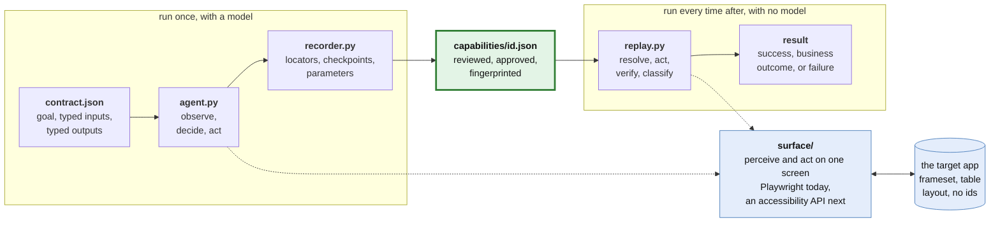
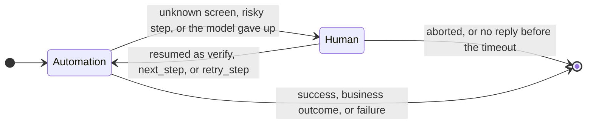

# teller: design write-up

## 1. Architecture

One Python process per run, and a directory on disk as the only shared state between
processes. The shape of the system is one idea: a model runs on the left of the
artifact and never on the right.

Three things wrap both loops and are deliberately not drawn: `policy.py` checks every
action before it happens, `evidence.py` records every action after it, and
`handoff.py` can take the session away from either loop and give it to a person.

**The contract comes first.** Before discovery runs, the caller declares what the
capability is for: a goal in plain language, typed inputs, typed outputs. The model
is asked only to work out *how*. That split is what makes the artifact a callable
capability rather than a transcript with a name. The recorder knows which value
became `{member_id}` and which cell became `savings_balance` because those names
existed before the run.

**One surface abstraction.** `Surface` turns what is on screen into an `Observation`
(numbered controls and cells, each with a role, an accessible name, a frame path, a
position, and for table cells the row and column it sits in) and executes actions.
Discovery acts by ref number from the latest observation; replay acts through
locators recorded in the artifact. Nothing above this layer knows what a DOM is. The
Playwright implementation computes names the way a screen reader would (aria, label,
button text, and for legacy table forms the text of the cell before it) and never
uses ids, classes or test hooks for identity. Models that accept images also get a
screenshot with the same numbers drawn on it.

**The model is a seam, not a dependency.** `Model` is a protocol with one method and
three implementations: Anthropic, any OpenAI-compatible endpoint, and a scripted
stand-in that keeps the end-to-end tests deterministic and offline. One canonical
transcript is translated per provider, so recorder, redaction and evidence see the
same thing whichever model drove the run. This started as a constraint, since I had no
API budget, and is the right shape regardless: a bank will not hard-wire one model
vendor into the component driving its core, and since no model is in the production
path, the cheapest one that can finish discovery is the correct choice. The evidence
here was produced by **qwen2.5:7b running locally through Ollama**, recorded in each
capability's `provenance`. That is weaker than I would use in production, which turned
out to be useful (section 3).

**Code handles the known, the model handles the unknown.** Interstitials the profile
already knows about are handled during discovery by the same code path replay uses,
before the model is asked, so the model spends its turns on the task and the recording
does not contain "click Acknowledge" as a step.

**A directory is the bus.** A run directory holds the log, screenshots, snapshots, the
result, and during a handoff the intervention request and reply. The operator CLI is a
separate process that reads that directory and attaches to the live browser over CDP.
No queue, no service, and a person could do the operator's job with a text editor.

Deliberate trade-offs: Playwright, because role-based locators are the closest a
browser comes to "what a person sees"; one process, because the brief says scaling
infrastructure is not the point; and a local sample app rather than a public site,
because I wanted framesets, table layouts, quirks mode, injectable runtime faults, and
a second deployment of the same product to test reuse against.

## 2. Artifact schema

A `Capability` (`teller/schema.py`) is JSON, versioned, and meant to be read in a code
review. The top level is the contract: `id`, `version`, `status` (`draft`,
`approved`, `retired`), `inputs`, `outputs`, `risk`, and `app` (which profile and
product version it was recorded against). Below that are `steps`, a `success`
checkpoint, capability-specific `outcomes`, and `provenance`.

**Targets carry several locators, in order of trust.** A `Target` describes a control
the way a person would (`describe`, `role`, `name`, `frame`) plus ordered `Locator`
strategies, each with a `note` saying why it should hold. The recorder picks the order
from where the control's name actually came from, because that determines which lookup
can find it again.

| strategy | how it finds the control | the recorder puts it first when |
|---|---|---|
| `role` | ARIA role plus accessible name, the way a screen reader finds it | the control has a real label or its own text |
| `row_label` | the control in the row whose first cell reads X | the name came from the cell before it, which is how legacy table forms are built and which an accessible-name lookup will not see |
| `table_cell` | the cell under column X, in the row containing Y | the target is a data cell in a grid |
| `label`, `placeholder`, `text` | the obvious ones | the name came from that attribute |
| `css` | a structural path | never; it is the labelled-brittle last resort |
| `bbox` | the screen position at recording time | never; off unless policy enables coordinate fallback |

`table_cell` is why one capability reads Priya's balance from the first row and Elena's
from the second without knowing either. `css` earns its place only as the thing that
keeps a run alive long enough to report drift, which is exactly what it did on the
cross-tenant run in section 4.

**Every step has a checkpoint.** `expect` says what must be true afterwards: URL
pattern, visible heading, text fragments, or a control that must be visible. Replay
never assumes a click worked. Steps also record `on_url`, the page they were recorded
on, which is what makes recovery possible.

**Values are parameterized, not stored.** The recorder swaps concrete input values for
`{name}` in step values, URL patterns, headings and descriptions, then turns any path
segment still carrying digits into `*`, because a segment we never supplied, such as an
account number the server just generated, differs next time. I found that the hard way:
the first sub-account replay failed its final checkpoint on the recorded account number.
The heading check still guards the state.

**Outputs are typed and say where they come from:** a type, a description for the
calling agent, a `source` target, and a `parse` rule. Money comes back as a decimal
string on purpose.

**Approval binds to a fingerprint.** `fingerprint()` hashes what decides a replay's
behaviour (inputs, outputs, steps, success, outcomes, app). Replay refuses a draft or
anything edited since approval. Provenance sits outside the hash so approving does
not invalidate itself.

`to_tool_schema()` renders the same artifact as a function-calling tool definition
(`teller catalog --tools`), so an agent can discover and invoke capabilities by name
with typed arguments. That stretch goal fell out of having a real contract.

## 3. Determinism & error handling

Replay is a fixed loop with no branch decided by a model:

1. observe; if a known condition is showing, handle it first;
2. check we are on the page the step was recorded on, otherwise go back;
3. resolve the target through its locators, first one yielding exactly one visible
   match wins, a fallback match is logged as `drift`;
4. policy check; act; for `type`, read the field back;
5. wait for the checkpoint, bounded by the step timeout, bailing early if a known
   condition appears;
6. if it fails, classify the screen.

The taxonomy is data, not code. A `Condition` is a detector (URL regex, text regex,
HTTP status, a visible control), a kind, and for recoverable ones a handler. The kinds
are what the result contract keeps apart, because conflating the first two is the
mistake that makes a caller treat a legitimate answer as an outage.

| kind | what it means | what replay does | in the sample app |
|---|---|---|---|
| `outcome` | the app answered, and the answer is news the caller needs | stops and returns a code plus the message from the screen | `not_found`, `validation_error`, `permission_denied` |
| `recoverable` | something got in the way that is not about this task | applies the handler, re-checks, carries on, and says so in the result | `session_expired` re-signs in, `system_notice` is dismissed, `host_busy` waits |
| `fatal` | the app broke | stops with the step, what was expected, what was observed, a screenshot and a page snapshot | `app_error` |
| unmatched | nobody has seen this screen before | hands the live session to a person (section 5) | the password expiry alert |

Conditions live in the app profile, because "No member found" is knowledge about
Meridian rather than about one capability. A capability may add its own, checked first.

Recovery retries a *page group*, the run of steps recorded on the same URL, not a
single step. Form state lives on a page, so a recovery that moved us off it invalidates
the half-filled form behind us; the engine returns to the page and re-runs the group
from its first step, with a bound. Every retry, recovery and drift lands in
`StepResult`, so a result says not just "success" but "success, after re-authenticating
at step 1".

**What a weak model exposed.** The 7B finished the three-step read flow first time. On
the nine-step write flow it failed twice, and both failures were my design's fault:

* It reached for the `navigate` tool and guessed a URL instead of clicking the link two
  lines above it in the listing. `navigate` is now withheld from discovery by default
  (`discovery.may_navigate`). The argument is not that a small model misused it: a
  recorded URL hop is the least portable thing a flow can contain, because paths are
  exactly what differs between tenants and versions. It stays behind a policy flag for
  genuinely unreachable deep links.
* It clicked ref 1, "Home" in the navigation frame, when it wanted a link in the content
  frame, because a frameset's menu was occupying the first ref numbers on every screen.
  Observations now list controls before text and the content frame first, which mirrors
  how a screen reader user moves through a page and helps any model.

I would rather report that than quietly re-run until a transcript looked clean. Two
bugs I introduced and fixed are pinned by tests for the same reason: a loose detector
read "Passwords must be changed every 90 days" as a validation outcome, and the
card-number redaction pattern matched the timestamp in run ids and scrubbed evidence
paths out of results.

Drift is secondary here, as the brief says, but the artifact is built for it: several
locators per target, and `drift` plus `locator_used` recorded per step, so a fleet can
see which capabilities are one locator away from breaking before they break.

## 4. Heterogeneity & multi-tenant

**Surface abstraction.** The seam is `Surface` plus the shape of `Target`. A target
states role, name, frame path and strategies; a surface decides which of those it can
honour. Legacy web is the case I built against: framesets, table layouts, no ids, and
quirks mode, where a heading is detected by being bold and larger than the text around
it rather than by tag. A desktop app implements the same protocol over an accessibility
API such as UI Automation: `role` and `name` map onto accessibility roles and names,
`frame` becomes the window or pane path, `table_cell` becomes a grid pattern lookup, and
`bbox` becomes first-class rather than a last resort. The perception script becomes a
tree walk, and recorder, replay, policy, handoff and evidence do not change. The one
genuinely new idea it needs is checkpoints, since `url` means nothing there: the surface
would expose a window-title-and-heading signature, and `Checkpoint` grows one field.

**Multi-tenant reuse.** Three layers, each smaller than the one above:

* the *app profile* (`profiles/meridian.yaml`) is per vendor product: sign-in, which
  frame holds content, the taxonomy of known screens;
* the *capability* is recorded against a profile, not a tenant, and holds no URLs,
  credentials or tenant-specific text;
* the *tenant overlay* (`tenants/summit-credit-union.yaml`) is the diff: base URL,
  version, a renamed content frame, an extra branded interstitial. Overlay conditions
  replace base conditions with the same id, so a tenant whose session expiry looks
  different swaps one entry rather than re-recording.

One artifact refers to the content frame as `@main` rather than by the name this
instance happens to use, so an integrator who renamed or re-nested that frame is an
overlay line, not a re-recording. That symbolic reference is the smallest change that
made the tenant story real rather than asserted.

This is demonstrated rather than argued. The sample app also runs as Summit Credit
Union: the same product with its own branding, release 4.4.02, a content frame named
`content`, a welcome banner, and one renamed menu item.
`evidence/replay-second-tenant/` is the capability recorded against the base
deployment, replayed against Summit untouched. The overlay absorbs the host, the frame
name and the banner. The renamed menu item is absorbed a level lower by the locator
fallbacks: role and text miss, the structural locator holds, and the result marks that
step `drift` with `locator_used: css`. That pairing is the signal worth collecting per
capability, tenant and version, because it says this tenant is one last-resort locator
away from breaking and needs an overlay entry now rather than after an outage. The
fields are in every result today; nothing aggregates them yet.

## 5. Escalation & handoff

One live session per run, one controller at a time, and `ControlBroker` owns that
fact. Automation refuses to act while a person holds the session, and the state is
written to `control.json` so anyone can see who is in control.

**Detecting stuck.** Three explicit triggers: replay hit a screen no condition matches
(after retries and the checkpoint timeout); a risky step needs sign-off; the model
called `give_up` with `needs_human` during discovery. Timeouts are bounded everywhere,
so a hung page arrives here rather than hanging.

**Routing.** The broker writes `intervention.json` into the run directory: capability
and goal, the step, the URL and heading, what was expected and observed, a fresh
screenshot, the redacted inputs, the CDP endpoint, and instructions. Then it flips
control to human and waits, draining what the person does into the log as it waits.

**Taking over the same session.** The browser is the one automation opened. A person
can use its window, or attach any tool to the CDP endpoint; the scripted operator in
the evidence does that from another process, clicking "Remind Me Later" in the content
frame. Human actions are captured by a script installed in every frame before page code
runs, recording clicks, changes and submits by control description and never by typed
value, buffered in session storage so it survives the navigation a click causes.

**Handing back.** The reply says `resumed` or `aborted`, a note, and where to resume:
`verify` (re-check the checkpoint and continue if it holds), `next_step` (the person
finished it), or `retry_step`, where an approval resumes. Abort and timeout are
distinct failure codes carrying the operator's note, and the whole exchange is a
`Handoff` on the result, so the caller knows a person was involved.

Mocked: the operator UI is a terminal. Real: the request with context, the control
transfer, the shared session over CDP, the capture of what the person did, the resume
semantics, and the timeout.

## 6. Safety

One policy file, enforced in one function, called before every action by both
discovery and replay. Origins are allowlisted; paths can be allowlisted and blocked
(the sample app's test hooks and the sign-out link are blocked, so automation can
never touch them); action types are allowlisted; navigation targets are checked before
the navigation happens.

Risk is judged from what a person would read on the control (confirm, submit,
transfer, delete, close account) and where its form posts, and a risk level recorded
at discovery sticks at replay. The mode is the institution's call: `block`, `confirm`
(the default, signed off through the same handoff mechanism) or `allow`. Opening a
sub-account is the worked example: discovery stopped for approval before the confirm
click, the step and the capability are marked risky, and replay stops there too. A
declined approval ends the run before anything is posted.

Credentials come from the environment and are typed by the surface, never seen by the
model and never in an artifact. Inputs marked `sensitive` are never logged or stored;
the model writes `{name}` and the surface substitutes. A `Redactor` wraps every write
to disk with known secret values plus regex patterns for SSNs and card numbers.
Transcripts are saved with screenshots removed.

Limits, honestly: screenshots are stored as-is, so PII visible on screen sits in the
run directory. Regex redaction catches formats, not meaning, so a balance is not
redacted. The allowlist is by origin and path, not by what a page does, so a risky
action behind a harmless-looking link is caught only if its name or form action gives
it away. JavaScript dialogs are dismissed and logged rather than reasoned about. And
policy trusts the process it runs in: a hostile page cannot change it, a hostile
operator can.

## 7. Cuts

Each of these is a stop with the seam left in place, not an oversight.

* **Desktop surface.** Designed for in section 4, not implemented.
* **Operator console.** A terminal and a CDP endpoint. A web console would read the
  same files and attach to the same session.
* **Screenshot masking.** Screens are stored as captured, so regulated data visible on
  one sits in the run directory.
* **Tenant fleet tooling.** The drift signal exists per step and is demonstrated on a
  second institution; nothing collects or reports it across many runs.
* **Path minimization.** A model's detour stays in the recording. I would rather show a
  reviewer the real path than silently edit it, and dropping a step to see whether the
  checkpoints still hold is the obvious next feature.
* **Rescuing a stuck discovery.** A person's steps are logged but not folded into the
  capability, so the run is marked failed rather than producing a flow with a hole in it.
* **Assisted fallback.** No bounded model recovery on replay failure. The handoff covers
  those cases with a person, which is the right default for a bank.
* **Stability scoring.** Replaying N times for a flakiness number is a loop around what
  already exists.

Next, in order: screenshot masking for regulated data, then path minimization, then the
cross-tenant drift signal, because those are the three I would want before running this
unattended against a real core.
